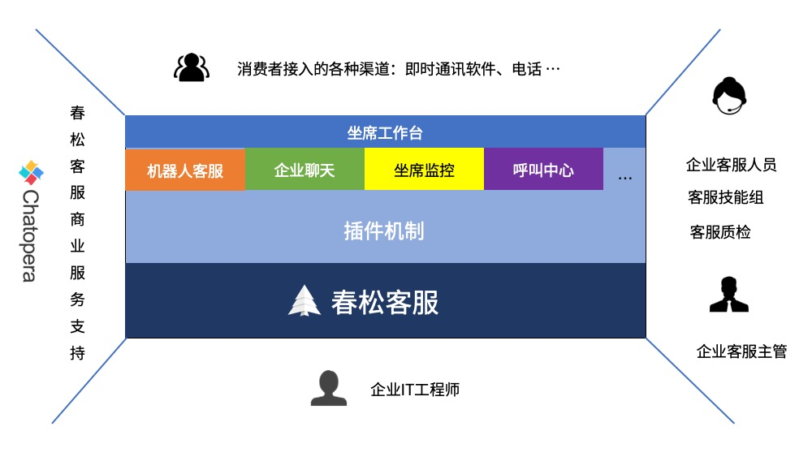
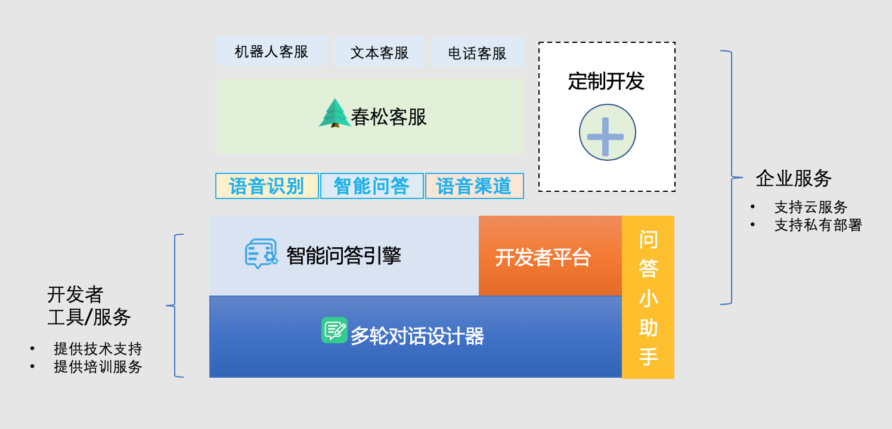
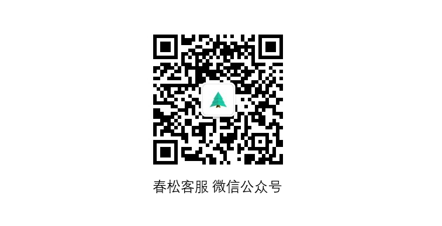

# 春松客服

[https://www.cskefu.com](https://www.cskefu.com)

春松客服是拥有坐席管理、渠道管理、机器人客服、数据分析、CRM 等功能于一身的新一代客服系统。将智能机器人与人工客服完美融合，同时整合了多种渠道，结合 CRM 系统，为客户打标签，建立客户的人群画像等，帮助企业向客户提供更加专业客服服务。

春松客服 v8 为开发中的大版本，在 2023 年正式发行。
目前，春松客服发行的稳定版本为 v7，进入[春松客服 v7 文档](/docs/)。

## 产品定义

客服系统是企业的重要工具，尤其是移动互联网时代，微信公众号、移动电话或是 Facebook Messenger 等渠道分散了企业的服务渠道，企业需要响应来自任何地点任何时间的客户。同时，企业的口碑至关重要，企业服务需要在客户获得、客户激活、客户留存等阶段无懈可击。

**春松客服**有下面的亮点：

### 模块化设计

将功能以插件形式模块化，适合企业长期使用，尤其是中小型企业，灵活购买高级插件。

### 部署方便

以容器化基础，安装使用 Docker 编排，卸载等非常简单。

### 机器人客服

强大的机器人客服解决方案，与 Chatopera 机器人平台等产品集成。

## 使用场景角色

### 客户

需要智能客服系统的企业。

### 客服人员

指代客户的客服团队的工作人员。

### 访客/消费者

指代甲方的客户，是需要通过联系客服人员咨询问题的人。

### 开发人员

指代智能客服系统的开发者，开发人员应该是有权限修改智能客服系统代码的人，包括 Chatopera 工程师和春松客服开源社区开发者。

### 业务专家

指代熟悉客户业务的人员，业务专家可以提供产品设计的意见，可以参与智能问答的质量评定，也可以作为管理员登录智能客服系统，配置系统，管理智能对话和训练。

## 关注春松客服公众号

及时获得产品更新、活动分享等信息。

