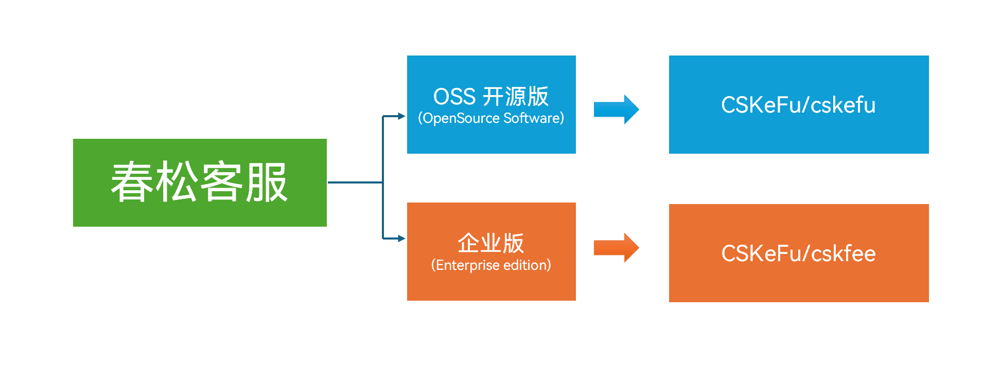

# 产品形式及授权

春松客服是一个企业客服系统解决方案，通过模块化完成企业客户服务工作的运营，包括座席工作台、联系人管理、访客渠道和会话管理等。

目前，春松客服包括两个产品和服务模式：

| 模式 | EE / 企业版 | OSS / 开源版 |
| --- | --- | --- |
| 是否开源 | 否 | 是 |
| 收费模式 | 根据服务项目进行[商业洽谈](https://www.chatopera.com/mail.html) | 启动服务后导入[授权证书](https://store.chatopera.com/product/cskefu001) |  
| 软件迭代 | 官方团队迭代开发 | 通过[开源社区](https://www.cskefu.com/)形式 |
| 源码许可证 | 闭源，购买后提供下载地址，可任意修改、销售 | [春松许可证, v1.0](/docs/docs/osc/license) |
| 技术支持 | 官方技术团队商业支持 | 通过开源社区[提交工单](https://github.com/cskefu/cskefu/issues) | 
| 部署及运维 | 官方技术团队商业支持 | 根据开源社区文档，[文档中心](/docs/docs/) |
| 使用培训 | 客服系统及二次开发的培训由官方团队支持 | 购买[春松客服大讲堂](/docs/docs/osc/training) |

## EE / 企业版

春松客服企业版由 [Chatopera](https://www.chatopera.com/) 提供，咨询详细功能、定制开发、报价或合作：[联系我们](https://www.chatopera.com/mail.html)。

春松客服由 [Chatopera](https://www.chatopera.com/) 于 2018 年发布，持续迭代，春松客服开源版核心代码来自于 Chatopera 团队多年的深耕，是您在使用春松客服解决方案最可靠的选择！

## OSS / 开源版

春松客服以【使用授权证书】的形式收取服务费用。春松客服内置免费的可用的资源，赠送这些资源是为了帮助企业用户体验春松客服。

春松客服使用授权证书是通过 Chatopera 证书商店（ https://store.chatopera.com ）分发的对【春松客服计费资源】进行管理的凭证，在使用春松客服的过程中，春松客服与 Chatopera 证书商店集成，完成证书购买、证书绑定、配额扣除、配额同步和开具发票等。

### 春松客服 v8 配额套餐包

春松客服 v8 使用授权证书导入分为三个步骤：

* 购买使用授权证书
* 复制使用授权证书标识
* 导入春松客服 v8

####  购买使用授权证书

购买，使用说明等详细介绍，打开证书商店： 

[https://store.chatopera.com/product/cskefu001](https://store.chatopera.com/product/cskefu001)

#### 复制使用授权证书标识

进入证书商店【证书】列表：

[https://store.chatopera.com/store/license](https://store.chatopera.com/store/license)

找到刚刚购买的证书，进入详情页面。

点击【复制证书标识】，这是证书标识被复制到了系统粘贴板。

#### 导入春松客服 v8

以超级管理员 【admin】的身份登录春松客服，导航至【系统管理-使用授权-授权证书列表】。

在弹出的表单中，粘贴【证书标识】，点击【立即提交】。

导入完成。