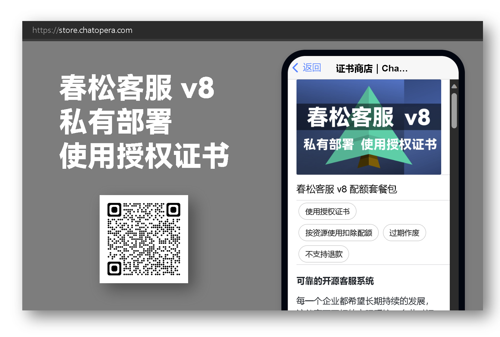

# 使用授权

春松客服以【使用授权证书】的形式收取服务费用。春松客服内置免费的可用的资源，赠送这些资源是为了帮助企业用户体验春松客服。

## 证书商店

春松客服使用授权证书是通过 Chatopera 证书商店（ https://store.chatopera.com ）分发的对【春松客服计费资源】进行管理的凭证，在使用春松客服的过程中，春松客服与 Chatopera 证书商店集成，完成证书购买、证书绑定、配额扣除、配额同步和开具发票等。

## 春松客服 v8 配额套餐包

购买，使用说明等详细介绍，打开 [https://store.chatopera.com/product/cskefu001](https://store.chatopera.com/product/cskefu001)。

