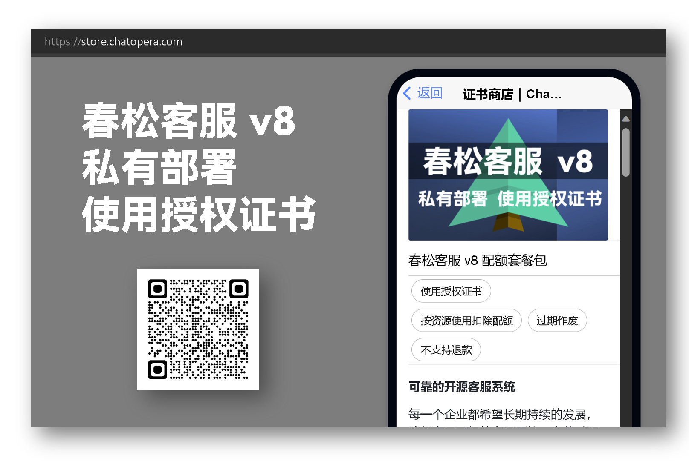

# 使用授权

春松客服以【使用授权证书】的形式收取服务费用。春松客服内置免费的可用的资源，赠送这些资源是为了帮助企业用户体验春松客服。

## 证书商店

春松客服使用授权证书是通过 Chatopera 证书商店（ https://store.chatopera.com ）分发的对【春松客服计费资源】进行管理的凭证，在使用春松客服的过程中，春松客服与 Chatopera 证书商店集成，完成证书购买、证书绑定、配额扣除、配额同步和开具发票等。

## 春松客服 v8 配额套餐包

春松客服 v8 使用授权证书导入分为三个步骤：

* 购买使用授权证书
* 复制使用授权证书标识
* 导入春松客服 v8

###  购买使用授权证书

购买，使用说明等详细介绍，打开证书商店： 

[https://store.chatopera.com/product/cskefu001](https://store.chatopera.com/product/cskefu001)

### 复制使用授权证书标识

进入证书商店【证书】列表：

[https://store.chatopera.com/store/license](https://store.chatopera.com/store/license)

找到刚刚购买的证书，进入详情页面。

点击【复制证书标识】，这是证书标识被复制到了系统粘贴板。

### 导入春松客服 v8

以超级管理员 【admin】的身份登录春松客服，导航至【系统管理-使用授权-授权证书列表】。

在弹出的表单中，粘贴【证书标识】，点击【立即提交】。

导入完成。