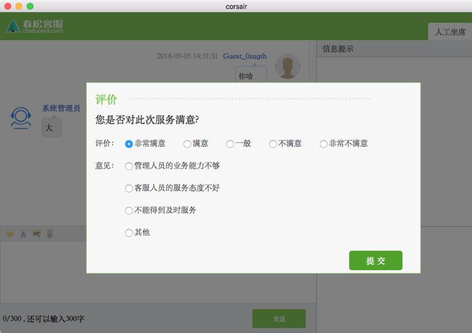
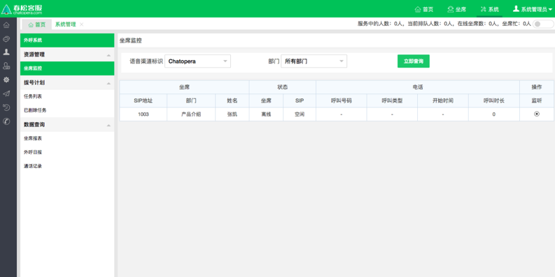

# 坐席监控

## 视频教程

本文介绍如何完成春松客服开发环境的搭建，**面向企业/开发者提供关于春松客服二次开发的相关知识，从入门到掌握全部开发技能请学习[《春松客服大讲堂》](https://docs.cskefu.com/docs/osc/training)**。

## 查看历史会话

_左侧菜单_ -> _会话历史_ -> _历史会话_

## 查看当前会话

_左侧菜单_ -> _会话历史_ -> _当前会话_

## 查看排队队列

_左侧菜单_ -> _会话历史_ -> _排队队列_

## 查看访客留言

_左侧菜单_ -> _会话历史_ -> _访客留言_

## 查看满意度统计

_左侧菜单_ -> _统计功能_ -> _满意度统计_

## 查看全部坐席

_左侧菜单_ -> _会话历史_ -> _坐席信息_ -> _全部坐席_

## 坐席监控

_左侧菜单_ -> _坐席监控_

