# 提交代码


本文档的作用：详细的说明如何提交代码到春松客服。

## 成为开发者我得到什么

手里没有几百万，作为开发者，您如何拥有一个软件产品呢？参与开源项目协作。参与迭代春松客服，成为[春松客服开发者](https://www.cskefu.com/core-developers/)，就是和众多有才华的人一道，做好开源客服系统，让您的潜能自由的发挥，在春松客服社区，您可以获得成就、朋友等很多财富。

作为一个开发者，加入春松客服开源社区就是和很多热爱软件研发的人一起做有经济价值的作品，春松客服是开放型组织，春松客服技术委员会主导社区发展，并以[分润的形式](https://www.cskefu.com/profit-sharing-plans/)合作共赢！通过社区高效率的协作体系，让您在工作之余，利用空闲时间产生更大的价值 - 提交 PR 到春松客服，在开源社区扮演关键角色！

本文撰写的主要目的，就是帮助您快速的掌握如何提交 PR[^what-is-pr] 到春松客服。

## 视频教程

以下内容已经发布视频，观看地址：

* [Bilibili](https://www.bilibili.com/video/BV1D8411q73M)
* [YouTube](https://www.youtube.com/watch?v=lYCdIgxXUSE)

视频和以下文档结合，可以更快的掌握提交代码的过程，建议先看视频后看文档。

## 前提准备

按照以下顺序安装依赖工具，这些操作过程中，Git Flow 的安装稍显麻烦，但是 Git Flow 是必要的，当您遇到问题，可以创建 [Issue 来取得帮助](https://github.com/cskefu/cskefu/issues/new?labels=help-wanted&projects=&template=1_help.md)。

### Bash 命令行终端

命令行终端推荐安装如下：

* Windows: [Git Bash](https://gitforwindows.org/)
* Mac: [iTerm2](https://iterm2.com/)
* Linux: 不同 Linux 发布的默认的控制台工具即可

不同操作系统的 Bash 终端其命令行工具都是类似的，下文使用的命令也是通用的，下文以 Windows Git Bash 为例。

### Git

* Windows: [Git Bash](https://gitforwindows.org/)
* Mac 和 Linux: [安装 Git](https://git-scm.com/book/zh/v2/%E8%B5%B7%E6%AD%A5-%E5%AE%89%E8%A3%85-Git)

完成以上工作，您就可以打开命令行终端，并执行命令：

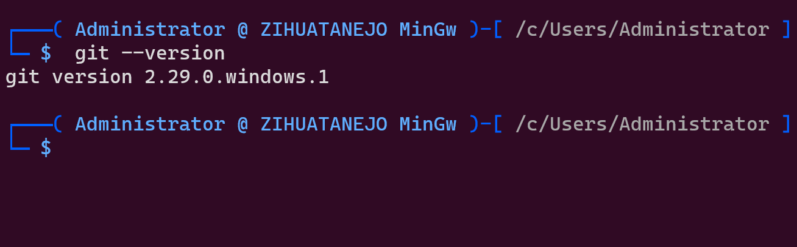


### Git Flow

Git Flow 是使用 Git 做研发软件协作的补充工具集，提供在 Git 命令基础上的[最佳实践](https://blog.csdn.net/Xue_zenghui/article/details/95212544)。下文将使用 Git Flow 简单高效的完成 PR 提交的流程。

* Windows: [安装 Git Flow](https://www.jianshu.com/p/8a804d8bf08b)
* macOS: [安装 Git Flow](https://juejin.cn/post/7057102433704476708)
* Linux: [安装 Git Flow](https://blog.csdn.net/u012336923/article/details/50425879)

安装好 Git Flow 后，通过命令行 `git flow` 来使用，不影响其它的 `git` 命令。


### SSH Keys

生成 SSH 密钥文件，用于加密认证，使用 `git` 下载上传代码。如果您已经有了 SSH Keys 本步骤可以跳过，即:

```
$HOME/.ssh/id_rsa $HOME/.ssh/id_rsa.pub
```

其中，`$HOME/.ssh/id_rsa ` 是私钥文件，您自己保留，不要公开共享；`$HOME/.ssh/id_rsa.pub` 是公钥，可以公开共享。

生成 SSH Keys 执行命令：

```
ssh-keygen -t rsa # 弹出选项都按 Enter
```

确认，系统路径存在 `$HOME/.ssh/id_rsa.pub`，执行命令：

```
cat $HOME/.ssh/id_rsa.pub
```

### GitHub

* 注册 GitHub 账号：[https://github.com/](https://github.com/)
* 添加 SSH Keys: 注册完成后，打开 URL [https://github.com/settings/keys](https://github.com/settings/keys)，点击 `New SSH Key`

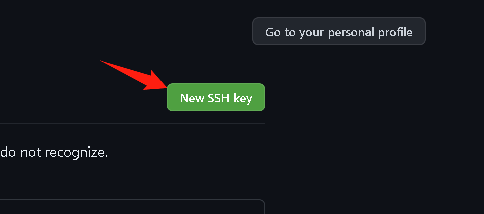

* 添加 Title 和 Key，即 SSH 公钥。

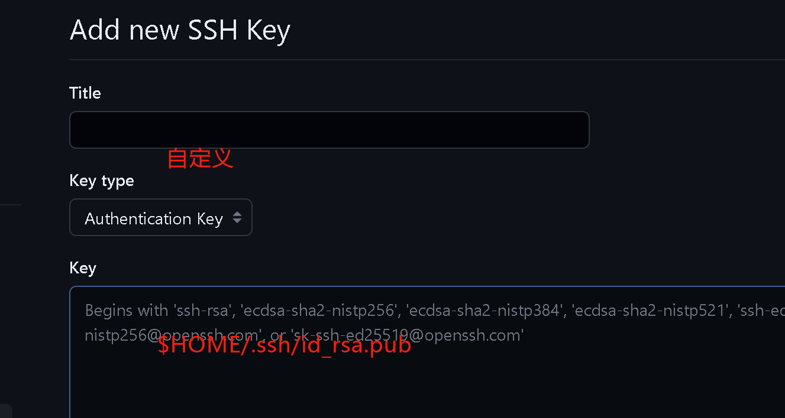


## 快速掌握

### 流程概述

整个提交 PR 的过程可以用以下时序图说明，我们将这个过程细化为十五步，实际上很简单，只需要按照描述完成一次，就可以掌握，而且除了第一个 PR，后面的 PR 只需要重复第 3-15 步。

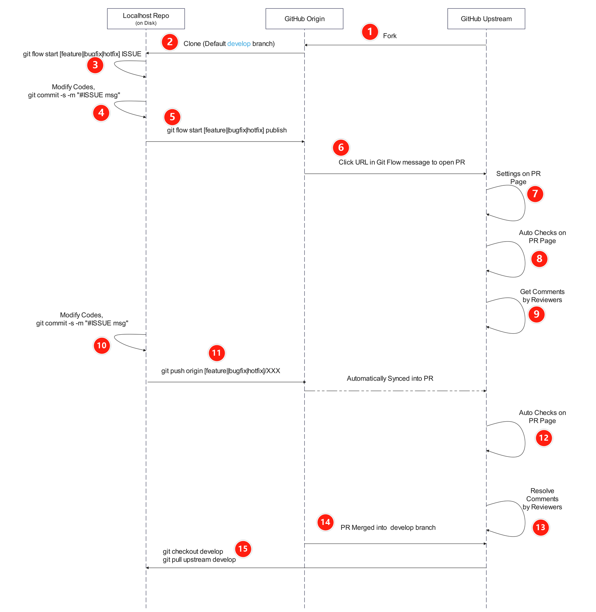

上图中，有三个仓库地址：

* **GitHub Upstream**, 即仓库 https://github.com/cskefu/cskefu ，简称 Upstream Repo
* **GitHub Origin**, 即 `https://github.com/${个人 forked repo}$/cskefu`，简称 Origin Repo
* **Localhost Repo**，即您使用 `git clone git@github.com:${个人 forked repo}/cskefu.git`, 简称 Local Repo

以上三个仓库在下面有详细介绍，主要原则：

* 工作前先有 Issue 号，比如 [https://github.com/cskefu/cskefu/issues/897](https://github.com/cskefu/cskefu/issues/897) 的 Issue 号就是 `879`，以下也使用 `#879` 指代 Issue 879;
* 代码最终进入 Upstream/develop 分支即属于进入春松客服，不要直接更改Local/develop 和 Origin/develop 分支，这两个 Repo 的 develop 分支的更新是通过 `git pull upstream develop` 来完成的。
* 代码是由[春松客服的 CodeOwners](https://github.com/cskefu/cskefu/issues/758) 合并进入 Upstream/develop 分支的。

### 1/15 Fork code repo

首先，打开 Upstream 网址 [https://github.com/cskefu/cskefu](https://github.com/cskefu/cskefu)，点击右侧的 `Fork`。

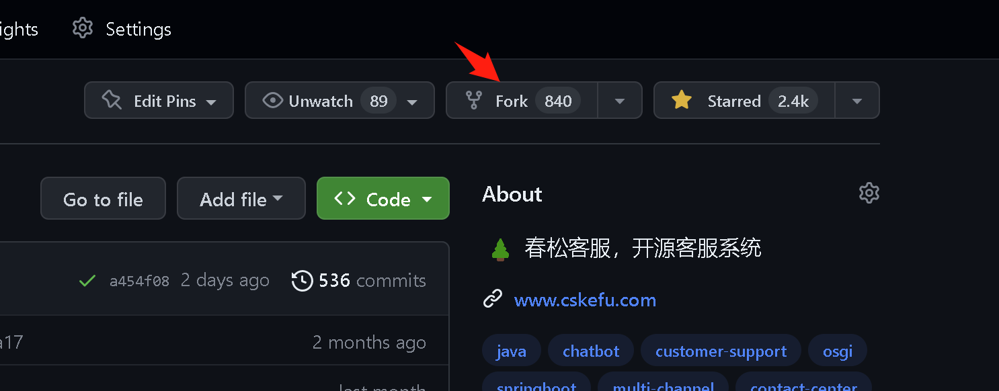

选择克隆到空间，取消`Copy the develop branch only` 选择。

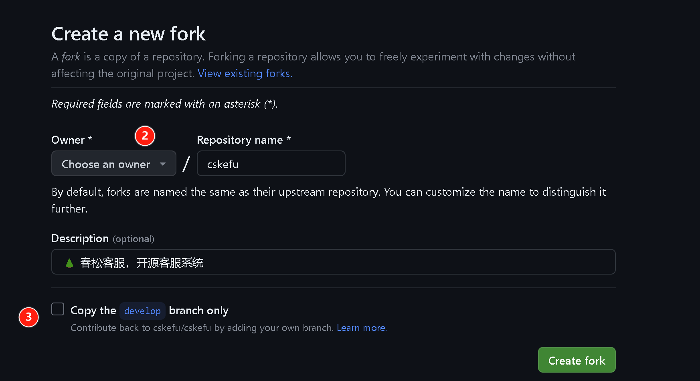

点击 `Create fork`，这时浏览器会跳转到 Origin Repo, 即您刚刚选择的空间下的 Repo 地址。

### 2/15 Clone code repo

使用 Bash 命令行终端，创建 Local repo，首先在浏览器中，获得 Origin Repo 的地址

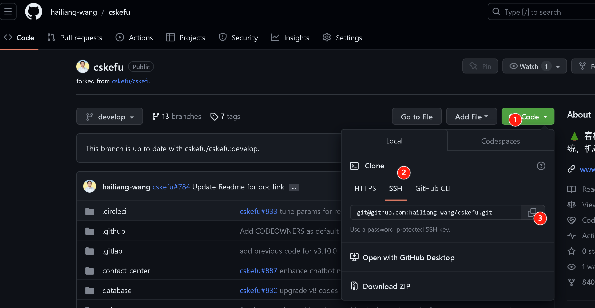

执行命令如下：

```
mkdir ~/cskefu
cd ~/cskefu
git clone git@github.com:${个人 forked repo}/cskefu.git # 从浏览器中复制的地址
```

然后，进入春松客服 Local Repo，设置 Sign-off。

```
cd ~/cskefu/cskefu # 以下称此路径为 CSKEFU_ROOT
git config alias.ci "commit -s"
git config user.name "您的名字"
git config user.email "您的邮箱"
```

该命令的作用是，在 `CSKEFU_ROOT` 下执行 `git ci -m "xxx"` 以完成签署 DCO[^what-is-dco]。

接下来，配置 upstream。

```
cd ~/cskefu/cskefu
git remote add upstream https://github.com/cskefu/cskefu.git
```


最后，初始化 `Git Flow`，执行

```
cd ~/cskefu/cskefu
git flow init
```

该命令会启动一个交互问答，按照如下设置，使用 Enter 进入下一个直至完成。

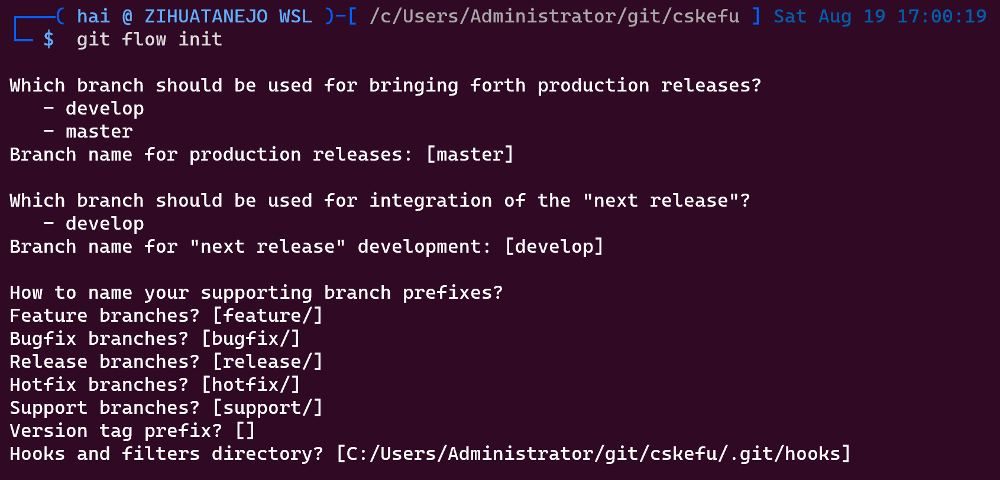

修改，如果设置错误，可以在运行了上述命令后，编辑 `.git/config` 文件。上面的主要步骤，围绕 `CSKEFU_ROOT/.git/config` 文件，执行后看起来如下：

```
[core]
        repositoryformatversion = 0
        filemode = false
        bare = false
        logallrefupdates = true
        ignorecase = true
[remote "origin"]
        url = git@github.com:${个人 forked repo}/cskefu.git
        fetch = +refs/heads/*:refs/remotes/origin/*
[branch "develop"]
        remote = origin
        merge = refs/heads/develop
[remote "upstream"]
        url = https://github.com/cskefu/cskefu.git
        fetch = +refs/heads/*:refs/remotes/upstream/*
[branch "master"]
        remote = origin
        merge = refs/heads/master
[gitflow "branch"]
        master = master
        develop = develop
[gitflow "prefix"]
        feature = feature/
        bugfix = bugfix/
        release = release/
        hotfix = hotfix/
        support = support/
        versiontag =
[gitflow "path"]
        hooks = C:/Users/Administrator/git/cskefu/.git/hooks
[alias]
        ci = commit -s
[user]
        name = Zhang San
        email = zhangsan@xyz.com
```


### 3/15 New local branch

对于提交的代码，是以 `Git Commits` 为单位的，每个 `Git Commit` 需要关联一个 GitHub Isssue 号，所以，先找到工作的 Issues：

[https://github.com/cskefu/cskefu/issues](https://github.com/cskefu/cskefu/issues)

假设，我们有了一个 GitHub Issue `#NUMBER`，比如 `#879`，这个 Issue 是一个新功能，那么，我们这样开始工作：

```
# 建立新的分支
cd ~/cskefu/cskefu
git flow feature start 879  # 执行，然后得到下面的提示信息
Switched to a new branch 'feature/879'

Summary of actions:
- A new branch 'feature/879' was created, based on 'develop'
- You are now on branch 'feature/879'

Now, start committing on your feature. When done, use:

     git flow feature finish 879
```

如上介绍，现在 Git 自动切换了新的分支，我们就在这个分支下调整代码。
显示了工作中的分支，您可以用命令 `git branch` 查看：

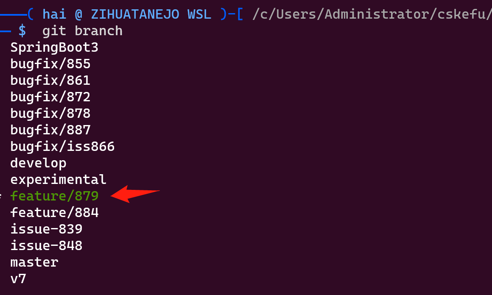

### 4/15 Commit sign-off codes

假设，我们已经调整完成了代码，通过 `git status` 查看变更的状态：

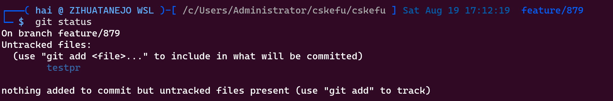


现在我们就可以提交代码了，执行以下的命令：

```
cd ~/cskefu/cskefu
git add --all
git ci -m "#879 调整了 XXX"  # 简要描述
```

注意，此处使用了 `git ci`，即是前文介绍的 DCO 签名，没有签名的 commit 的 PR 是不被接受的。

### 5/15 Git flow publish

下一步，将 Local Repo 的 Commit 发布到 Origin Repo 中，使用如下命令：

```
cd ~/cskefu/cskefu
git flow feature publish
```

在执行了上述命令后，得到提示：

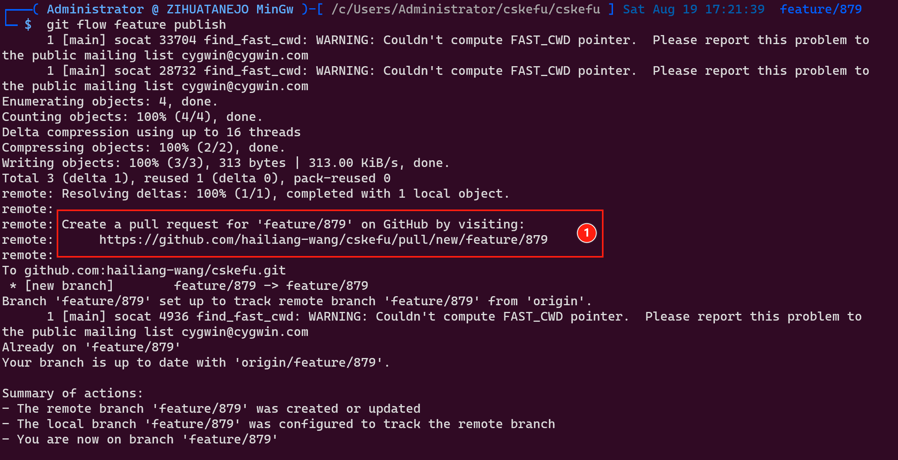

透露的信息是：1）Origin repo 的 'feature/879' 分支被新建或更新了，2）Local repo 的 'feature/879' 分支用来跟踪 Origin/feature/879 的变化。

### 6/15 Open new PR

需要注意的是，上一步的提示消息中，有一个 URL 地址：

```
https://github.com/${个人 forked repo}/cskefu/pull/new/feature/879
```

复制这个地址，并在浏览器中打开：

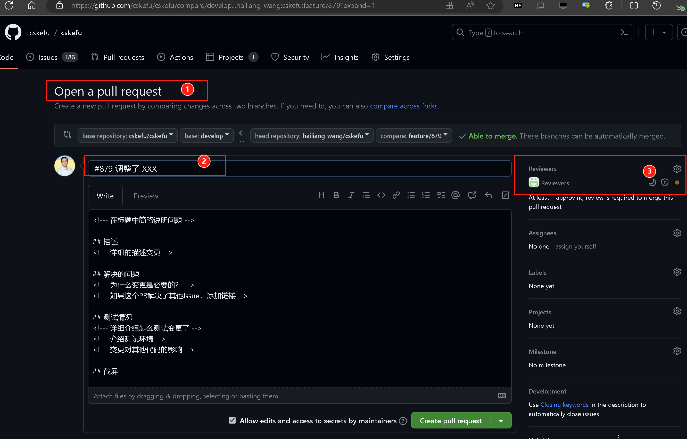

这个就是创建 PR 的界面，通过调整标题，正文，更好的描述本次变更的原因。然后点击右下角的 【Create pull request】。

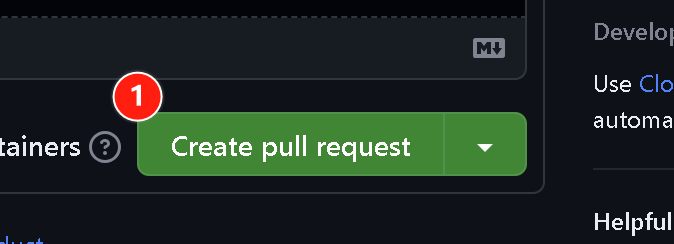

### 7/15 Set PR settings

提交后，浏览器自动跳转到新建立的 PR 页面，比如 [https://github.com/cskefu/cskefu/pull/900](https://github.com/cskefu/cskefu/pull/900)。

在这个页面，可以得到和添加更多的信息，比如查看审核者(Reviewers)，只有达到：

* Code 审核通过的人数超过设定（目前为 1 人），目前，审核者是自动设置的，详细的规则查看：[春松客服的 CodeOwners](https://github.com/cskefu/cskefu/issues/758)
* Code Review 没有讨论中的会话
* PR 的自动检查通过

PR 才可以由  CodeOwners 进行合并，分别对应 PR 页面中的下图部分的状态：

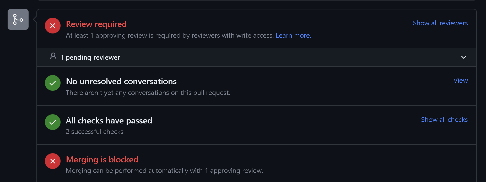

### 8/15 Checks on PR

在 PR 页面，您会看到类似的信息：

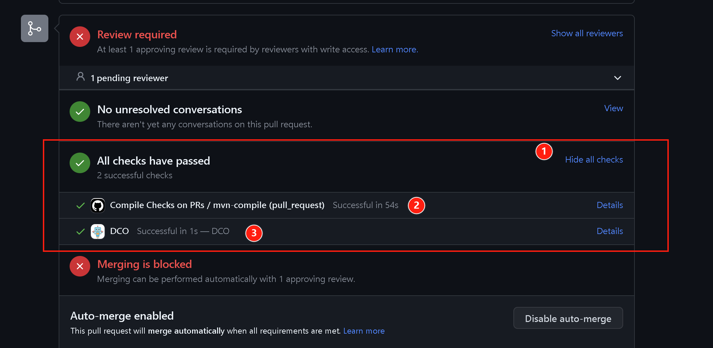

代表当前的 PR 自动检查通过，但是也可能发生不通过的情况，此时进入第 10/15 步解决。

### 9/15 Code reviews

在 PR 页面，您会看到类似的信息：

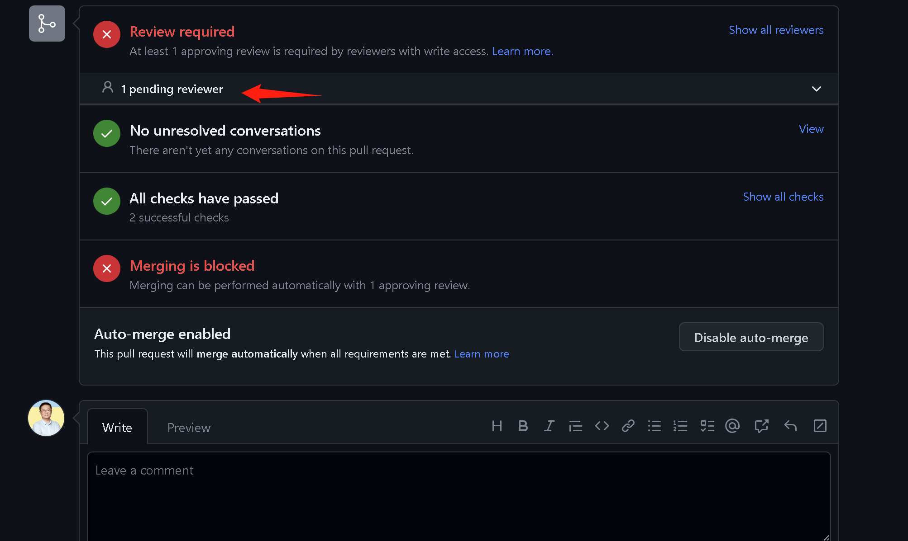

代表当前还需要完成 Code Review 工作，该 PR 才能被合并。

此时，Code Reviewer 会收到通知，Code Reviewer 会在 PR 的下面页面给与反馈：1）Comment/Request Changes - 代码还需要做一些调整，进入 10/15 步；2) Approve - 通过。

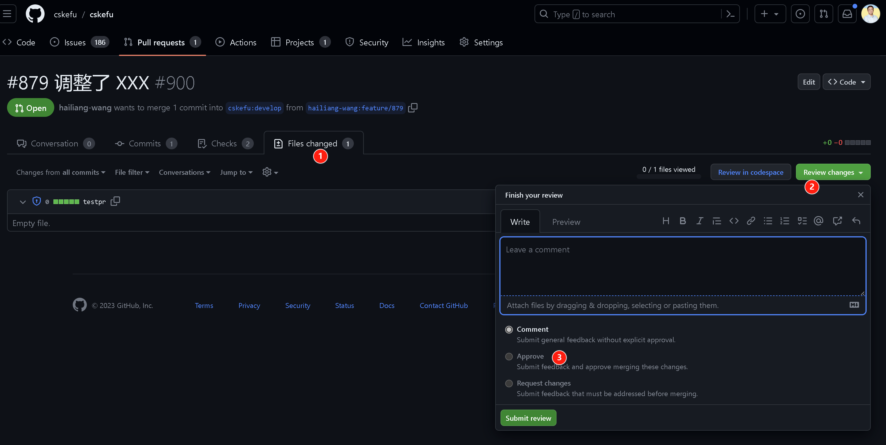

通过 Checks 和 Review，代码会自动进入 `upstream/develop` 分支。 

### 10/15 Modify codes

由于 PR Checks 或 Review 没有通过，那么根据反馈需要更改代码，进行如下操作。

* `cd ~/cskefu/cskefu`
* 确认 Local repo 所在分支为 `feature/879`；如果当前不在这个分支，使用 `git checkout feature/879` 切换回这个分支
* 调整代码，直到可以再次提交

### 11/15 Re-push codes

执行命令：

```
cd ~/cskefu/cskefu
git add --all
git ci -m "#879 再次调整 XXX"
git push origin feature/879
```

### 12/15 Checks on PR

回到前次创建的 PR 页面，在 Commits 页面，我们看到，已经有了第二次的提交。


此时，再次执行了 Checks。

### 13/15 Code reviews again

这时候，Code Reviewer 再次收到提示，进行代码 Reviews。您也可以在 PR 上与 Reviewers 交互，如下图。

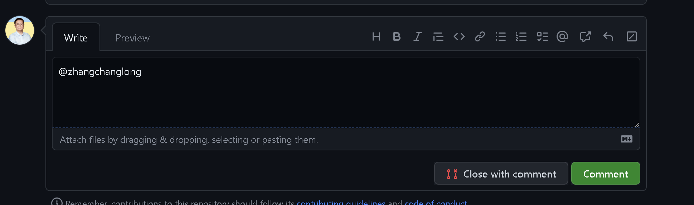

### 14/15 PR merged

假设，这次 Checks 和 Reviews 通过，满足了合并的需求，因为前文我们设置了【Auto-merge】，现在代码就会直接进入 `upstream/develop` 分支。

您也可以在 develop 分支确认：

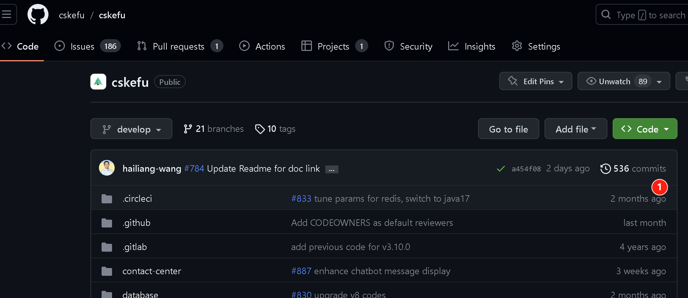

点击 `commits`。

### 15/15 Pull to local

现在，您的 PR 提交完成了，但是您的 Origin 和 Local Repo 的 develop 分支，还和 Upstream develop 不同步，继续执行以下操作：

```
cd ~/cskefu/cskefu
git checkout develop
git pull upstream develop
git push origin develop
```

作为候选，您可以删除本地的 feature 分支：

```
git branch -d feature/879
```

春松客服是最流行的开源客服系统，现在已经在企业部署超过 19,000 次，为数百政府机构、事业单位和企业上线智能客服系统，现在您是春松客服的开发者一员了！

春松客服会尽快的将您添加到[贡献者列表](https://github.com/cskefu/cskefu#%E8%B4%A1%E7%8C%AE%E8%80%85%E5%88%97%E8%A1%A8-)!


## 常见问题

### 如何确定工作的 Issue

Issue 即工作的内容，记录在春松客服的[工单(Issue)](https://github.com/cskefu/cskefu/issues)中，可以创建根据您自己的需要创建工单，或者选择一个已有的工单。

### 如何搭建开发环境

开发环境搭建，包括下载源码、安装 IDE、启动数据库和配置项目等。

详细内容，参考文档[开发环境搭建](https://docs.cskefu.com/docs/osc/engineering)。


### 如何快速入门定制春松客服

春松客服社区发布了[《春松客服大讲堂》](https://docs.cskefu.com/docs/osc/training)，快速的入门以及熟悉开发技能。

在《春松客服大讲堂》中，有很多知识内容，而单元测试、AOP 变成、自动化测试等也涉及，内容丰富。


### 如何快速掌握 Git


Git 用于版本管理，使用 Git 时，一个文件有三个可能存在的地方：indexed（索引区），staged（暂存区） 和 workarea（工作区）。indexed 文件就是被索引了（提交了）；staged 就是被临时的保存了（暂未提交，保护一下）；workarea，在编辑器中打开的这份。

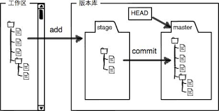

上图中 master 所在区就是 indexed。

Git 的版本管理，就是指这三个层面同一个文件的差异。

Git add: 从 workarea 添加到 staged

Git commit: 从 staged 到 indexed

当然还有不同的方向，这构成了 git checkout, git stash, git restore, git reset, git clean 等命令。

当本地的 Git 库和它的远程的 Git 库同步时，就涉及使用 git push 和 git pull。

以上是对 Git 的简要介绍，快速入门 Git，首先熟悉它的远离，比如以上；其次，做一些练习，比如使用 [practice-git](https://github.com/grayghostvisuals/practice-git)。

### 如何成为一个优秀的开发者

要从工作中获得更多快乐，同时也为了不断涨薪，就需要不断的前进，依赖于心态。

这是一个比提升技能更需要时间和重视的部分，一个好的开发者的心态，可以和一个觉悟者相提并论了，那些个看不到、摸不着的字节，完成你的复杂的逻辑，需要你保持稳定和理性的状态。

这方面有很多好的读物，比如[《程序员修炼之道：从小工到专家》](https://item.jd.com/10393278.html)、[《冥想》](https://item.jd.com/12058554.html)和[《程序员的自我修养——链接、装载与库》](https://item.jd.com/10024708744202.html)。这几本书，值得常看，常看可以常新。尤其是《冥想》，每天早晚各十分钟冥想，坚持 90 天，保证你成为程序员中的大师！

[^what-is-pr]: 什么是 PR？即 PullRequest，是合并代码的申请，春松客服的 PR 列表见 [https://github.com/cskefu/cskefu/pulls](https://github.com/cskefu/cskefu/pulls)
[^what-is-dco]: 什么是 DCO？DCO 是一种贡献者协议，代表您有权力将代码贡献至开源社区，春松客服合并的代码必须有 DCO 或 CLA 协议，详细介绍 https://www.cskefu.com/2022/10/19/vote-cla-dco-result/