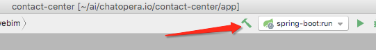
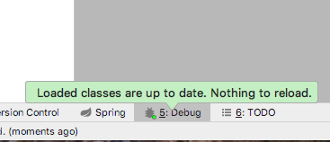

# IDE 使用之 IntelliJ IDEA

<< 回到[上一步](./engineering.md#初始化系统) <!-- markup:skip-line -->

## 视频教程

本文介绍如何完成春松客服开发环境的搭建，**面向企业/开发者提供关于春松客服二次开发的相关知识，从入门到掌握全部开发技能请学习[《春松客服大讲堂》](https://docs.cskefu.com/docs/osc/training)**。


## 生成项目描述文件

春松客服团队使用 [IntelliJ IDEA](https://www.jetbrains.com/idea/) 作为集成开发环境，它因为更加智能而大幅提升了开发者的工作效率，我们也强烈推荐 Java 开发者使用这个工具。本文使用`IntelliJ IDEA`介绍搭建过程。

在命令行终端，执行：

```bash
cd cskefu.osc
cd contact-center
./admin/gen-idea.sh
```

按照 `IDEA` 提示，导入 `contact-center/app` 目录。

## 配置执行及调试

配置运行方式为 Spring，应用为 `com.cskefu.cc.app.Application`


## 配置环境变量


## 运行及调试


点击"执行"或"调试"，服务启动，然后访问 <http://localhost:8035> 确定服务正常运行了。


**用户名**：admin **密码**：admin1234

## 热更新

在开发过程中，修改了代码，更新正在以 **“调试”** 模式运行服务，点击"执行旁边的锤子"。



更新成功后，提示



另外， **“调试”** 模式下，也支持断点调试。

<!-- markup:markdown-end -->

## 下一步

回到[开发环境搭建](./engineering.md#初始化系统)完成后续步骤。
