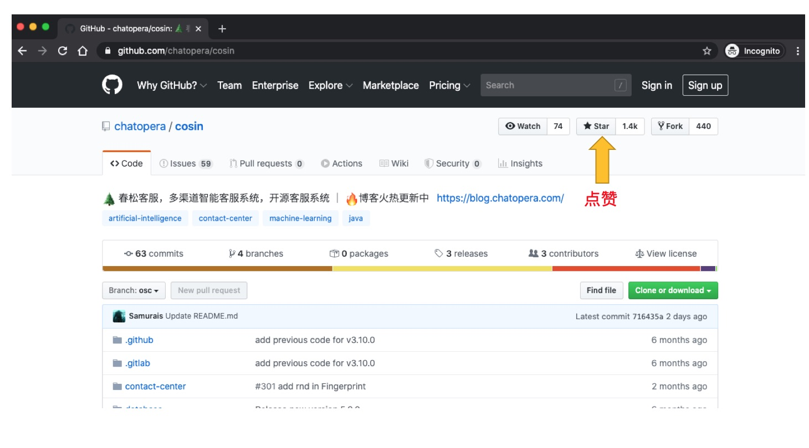

# 开源社区

      <!-- markup:skip-line -->

## 开源许可协议

春松客服采用[春松许可证，v1.0](https://docs.cskefu.com/licenses/v1.html)，详细了解该协议内容：

[开源许可协议](https://www.cskefu.com/2023/06/25/chunsong-public-license-1-0/)

## 加入春松客服开源社区

如何加入春松客服开源社区，[参考文档](https://www.cskefu.com/join-us/)

## 源码仓库

**开源项目地址：**

[Github](https://github.com/chatopera/cskefu) | [Gitee](https://gitee.com/chatopera/cskefu) | [CodeChina](https://codechina.csdn.net/chatopera/cskefu)

以上不同地址的代码同步，在上面的地址，您可以：

- 下载项目开源码
- 通过 README.md 了解更多项目信息
- 通过 Wiki 获得开发文档
- 通过 Issue 提问
- 通过 Pullrequest 贡献代码
- 通过 Issue 了解开发状态

在项目地址中，有详细的入门说明，如果使用遇到问题，第一时间[阅读文档](/products/cskefu/index.html)，第二时间搜索[历史 Issues](https://github.com/chatopera/cskefu/issues)，如果无法解决，加入社区提问。

## 邮件列表

春松客服邮件列表通过邮件服务沟通，跟踪最新的开发动态：

[https://lists.cskefu.com/cgi-bin/mailman/listinfo/dev](https://lists.cskefu.com/cgi-bin/mailman/listinfo/dev)

## 博客专栏

[**《春松客服专栏》**](https://blog.csdn.net/watson243671/category_9915986.html)火热 🔥 更新中，订阅关注，及时获得最新的信息。

<!-- markup:markdown-end -->

## 为春松客服点赞

您的关注、鼓励是开源项目的工作动力之一，请给春松客服点赞 👍！

